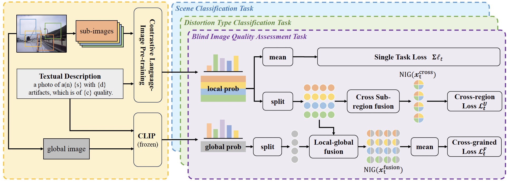

# DEFNet

Official code implementation of **Multitasks-based Deep Evidential Fusion for Blind Image Quality Assessment**

<div align=center></div>

## Abstract

Auxiliary tasks such as scene and distortion type categorization are beneficial for blind image quality assessment (BIQA). Existing methods have explored the scope of auxiliary tasks with an emphasis on quality assessment, while facing challenges regarding reliability due to the lack of in-depth information fusion and uncertainty estimation. In this paper, we introduce a deep evidential fusion framework based on multitasks for BIQA, which exploits advanced information fusion and uncertainty estimation techniques to improve the performance. Instead of merely concentrating on original tasks, the proposed framework enhances multiple tasks through a multilevel trustworthy information fusion strategy with the help of normal-inverse gamma distribution mixture. The strategy involves two levels of information fusion: cross sub-region and local-global. The former focuses on diverse features and patterns across sub-regions, while the latter fuses information from fine- to coarse-grained scales and balances detailed and global perspectives. Extensive experiments on datasets with synthetic and authentic distortion demonstrate the effectiveness and robustness of the proposed framework in comparison with state-of-the-art BIQA methods.

## Requirements

- clip==0.2.0
- numpy==2.1.0
- pandas==2.2.2
- Pillow==10.4.0
- scikit_learn==1.5.1
- scipy==1.14.1
- torch==2.1.0
- torchvision==0.16.0
- tqdm==4.66.1

## Dataset Preparation

Download BID, LIVE, CSIQ, LIVE-Chanllenge, KADID-10k, and KonIQ-10k datasets into the folder `IQA_database`.

## Usage

- To train the DEFNet:

```
python main.py
```

- For different task combinations, try to change the value of `mtl` in line 77.

```
mtl = 0 # 0:all(q+s+d)   1:q+s   2:q+d
```
